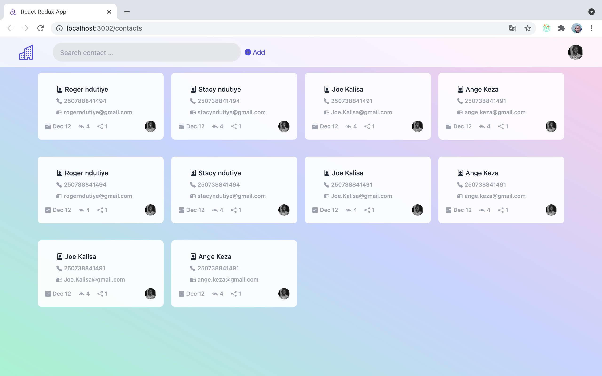
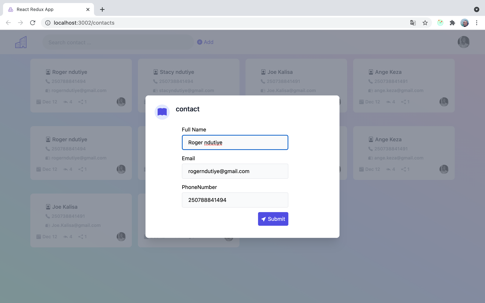

# Redux toolkit contact card

redux-toolkit-contact-card is a simple contact card crud app.

# Introduction

This is a simple contacts card app build with React, Typescript and redux-toolkit . Thank you for your visit and I am looking forward to hearing from you!

# Installation Instructions

Clone the repository, change directories, and use NPM to install the dependencies.

```bash
$ git clone https://github.com/rogerndutiye/redux-toolkit-contact-card.git
$ cd redux-toolkit-contact-card
$ npm install
```

## Usage

- start development server with `npm start` or `sudo npm start`

* `npm start`

now The project can be viewed in the browser at

- [http://localhost:3000](http://localhost:3000)

The page will reload if you make edits.\
You will also see any lint errors in the console.

## Screenshots





